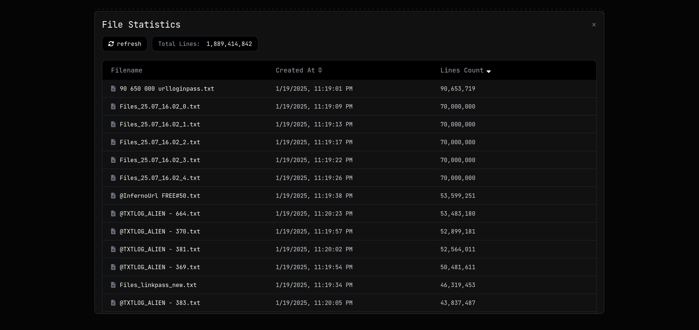

# StealerLogsDashboard

## Installation
1. **Clone the Repository**:
   ```bash
   git clone https://github.com/ayxkaddd/StealerLogsDashboard.git
    ```
2. **Install Python Dependencies**:
    ```bash
    pip install -r requirements.txt
    ```
3. Install [ripgrep](https://github.com/BurntSushi/ripgrep): Use your system's package manager to install `ripgrep`. For example:
    - On Ubuntu/Debian:
    ```bash
    sudo apt install ripgrep
    ```
    - On Arch based systems:
    ```bash
    sudo pacman -S ripgrep
    ```
    - On macOS (with Homebrew):
    ```bash
    brew install ripgrep
    ```

---

## Configuration
1. **Open the `config.py` file and specify the path to the folder containing your logs. For example**:
    ```python
    LOGS_PATH = "/path/to/your/logs"
    ```
2. **Update the `update_logs.sh` script to reflect the same log folder path.**

---

## Usage
1. **Generate File Stats Cache: Run the `update_logs.sh` script to parse the logs and create the `file_stats_cache.json` file**:
    ```bash
    ./update_logs.sh
    ```
    ⚠️ Note: This step may take some time, depending on the number and size of your log files.
2. **Start the Dashboard: Launch the application using `uvicorn`**:
    ```bash
    uvicorn main:app --reload
    ```
    By default, the app will be available at `http://127.0.0.1:8000`.

---

## Preview

<p align="center"></p>

<p align="center"></p>
